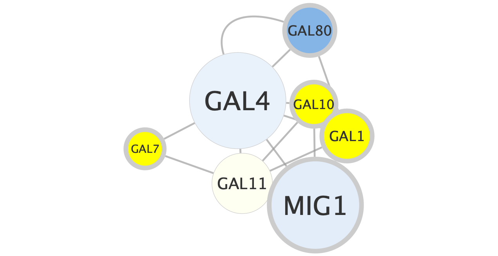
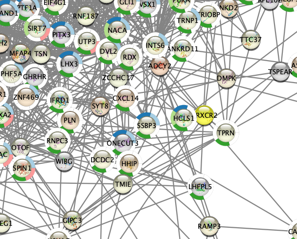
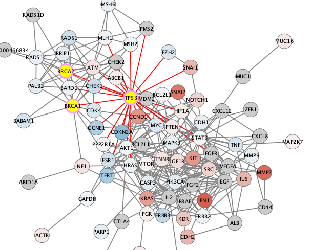

```{r setup, include=FALSE}
knitr::opts_chunk$set(echo = TRUE)
```


# Basic Data Visualization between GAL1, GAL4, GAL80



# Differentially Expressed Gene in Ovarian Cancer

## Example 1



## Example 2




